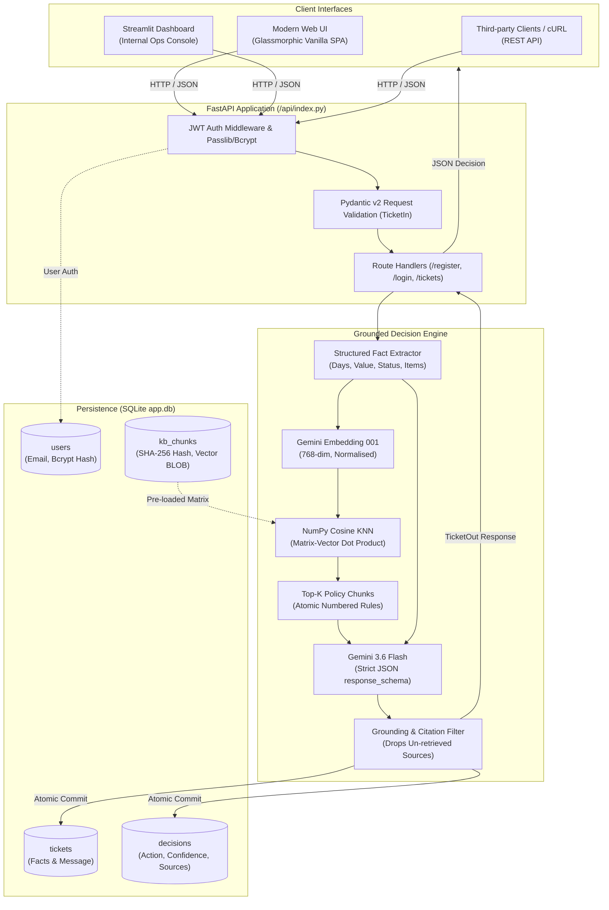
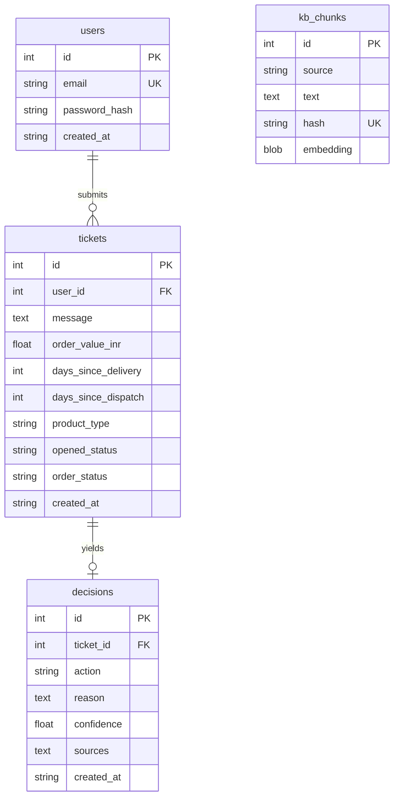

<div align="center">

# ⚡ ResolveAI
### *Enterprise Support Ticket Decision Engine Grounded in Verifiable RAG*

[](https://resolveai-ai.vercel.app)
[](https://resolveai-ai.vercel.app/docs)
[-6366f1?style=for-the-badge&logo=pytest&logoColor=white)](https://github.com/adisri19/resolveai)
[](https://www.python.org/)
[](https://aistudio.google.com/)
[](LICENSE)

<p align="center">
  <b>ResolveAI</b> transforms ambiguous, high-volume customer support tickets into deterministic, policy-compliant, evidence-backed decisions in <b>&lt; 800ms</b>.<br>
  Built with <b>FastAPI</b>, <b>NumPy-in-SQLite Vector Search</b>, and <b>Google Gemini</b> with zero framework bloat.
</p>

[🚀 Live Web Demo](https://resolveai-ai.vercel.app) • [📖 Interactive Swagger Docs](https://resolveai-ai.vercel.app/docs) • [📐 Architecture](#-system-architecture) • [📋 Decision Ontology](#-the-15-action-decision-vocabulary) • [🧪 Benchmarks](#-evaluation--benchmarks) • [🛠️ Quickstart](#-quickstart--local-setup)

---

</div>

## 📌 Executive Overview

Customer support automation often suffers from two fatal flaws: **hallucinated policies** that promise customers unauthorized compensation, and **opaque decisions** that human auditors cannot verify.

**ResolveAI** fixes this with a strictly grounded Retrieval-Augmented Generation (RAG) architecture:
- **100% Policy Grounding**: Decisions are strictly conditioned on atomic rules extracted verbatim from official store policies.
- **Strict 15-Action Ontology**: LLM generation is locked down via Pydantic v2 schemas; invalid actions are rejected at the model boundary.
- **Auditable Citations**: Every decision produces an arithmetic confidence score, an explanatory rationale, and an exact list of policy sources. Phantom citations are filtered out automatically.
- **Zero Hallucinated Facts**: If required facts (e.g. order value, delivery age, packaging state) are missing and alter the policy outcome, the engine outputs `NEEDS_MORE_INFORMATION` rather than guessing.
- **Zero-Bloat In-Database Vector Store**: No Chroma, Pinecone, or LangChain. Exact cosine KNN search is computed in microseconds via NumPy over SQLite BLOB storage.
- **100% Offline Testability**: Complete 26-test suite executes in `< 5s` without internet or API keys using deterministic vectorizer stubs.

---

## 📐 System Architecture



---

## ✨ Core Engineering Highlights

### 1. Atomic Rule Chunking (No Arbitrary Sliding Windows)
Traditional token sliding windows slice sentences in half or blend distinct policies. ResolveAI parses markdown policies directly along **numbered rule boundaries** (`1.`, `2.`, etc.). Every chunk is an atomic, self-contained constraint tagged with its document title.

### 2. Zero-Dependency Vector Search (NumPy + SQLite)
For corporate policies (~30 discrete rules), importing massive vector database frameworks introduces latency and dependency risk. ResolveAI caches 768-dimensional normalized embeddings as binary BLOBs inside SQLite. Similarity search is a single vectorized matrix dot product:
$$\text{Cosine Similarity} = \mathbf{M} \cdot \mathbf{q}$$
Retrieval executes in **sub-millisecond time** with zero external infrastructure.

### 3. Anti-Hallucination Grounding Gate
Even constrained models may occasionally cite familiar document names they never read. ResolveAI intercepts the generated decision and compares `sources` against the set of chunks actually retrieved for that query. Phantom citations are dropped, preserving strict chain-of-custody for compliance.

### 4. Outage vs. Information-Gap Isolation
Many systems catch model errors and blindly return "needs more information". ResolveAI rigorously separates:
- **`NEEDS_MORE_INFORMATION`**: An intentional business resolution returned when missing facts change the outcome.
- **`DecisionUnavailable` (HTTP 503)**: A network, quota, or upstream API outage. The transaction is aborted, nothing is persisted to the database, and evaluation runners flag it as an outage rather than a wrong answer.

### 5. Multi-Tenant Row-Level Security
- Passwords hashed with `bcrypt` (per-password salt, strictly capped at 72 bytes to prevent silent truncation exploits).
- Authenticated JWT bearer tokens.
- Ticket queries include `WHERE id = ? AND user_id = ?`. If Alice attempts to inspect Bob's ticket, she receives a **404 Not Found** rather than a 403 Forbidden, preventing account ID enumeration.

---

## 📋 The 15-Action Decision Vocabulary

The system is strictly bounded to the 15 canonical operational actions derived from historical business resolution logs:

| Category | Action | Operational Meaning |
| :--- | :--- | :--- |
| **Returns & Refunds** | `APPROVE_RETURN` | Authorize customer return for unopened change-of-mind within window. |
| | `APPROVE_REFUND_OR_REPLACEMENT` | Instantly approve refund or replacement (e.g. low-value damaged items). |
| | `APPROVE_REPLACEMENT` | Ship immediate replacement for confirmed defective items. |
| | `REPLACE_CORRECT_ITEM` | Dispatch the correct item when wrong merchandise was delivered. |
| | `CANCEL_AND_REFUND` | Cancel order and refund payment before shipment dispatch. |
| **Evidence & Investigation** | `REQUEST_PHOTOS` | Request packaging and product photos (orders $> \text{₹}2,000$). |
| | `REQUEST_DEFECT_EVIDENCE` | Request photo/video evidence of malfunction before replacement. |
| | `OPEN_SHIPPING_INVESTIGATION` | Escalate with carrier for shipments delayed beyond threshold. |
| | `WAIT_AND_TRACK` | Advise customer to continue tracking when within delivery SLA. |
| | `OFFER_REPLACEMENT_OR_REFUND` | Grant customer choice of refund or replacement for confirmed lost transit. |
| **Policy Rejections** | `REJECT_OPENED_ITEM` | Reject change-of-mind return because product packaging was unsealed. |
| | `REJECT_FOOD_RETURN` | Reject return because perishable/food items are non-returnable. |
| | `REJECT_OUTSIDE_WINDOW` | Reject claim submitted past policy timeframe (e.g. $> 7$ days). |
| | `CANNOT_CANCEL_AFTER_DISPATCH` | Refuse cancellation because order has already been dispatched. |
| **Fallback Gate** | `NEEDS_MORE_INFORMATION` | Critical fact missing (delivery date, opened state, etc.); request clarification. |

---

## 🖥️ User Interfaces

### 1. Modern Glassmorphic Web App (`/`)
Served directly via FastAPI and deployed on Vercel:
- **Interactive Preset Scenarios**: Instant 1-click loading for test cases (e.g. *Damaged ₹3,500 Order*, *Unopened Cosmetics*, *Stalled Transit*, *Wrong Item Received*).
- **Dynamic Action Badging**: Color-coded badges (Emerald for Approvals, Rose for Rejections, Amber for Evidence Requests).
- **Real-Time Confidence Gauge**: Visual indicator reflecting arithmetic certainty.
- **Traceable Policy Sources**: Displays exact policy file tags backing the recommendation.
- **Session History & Live JWT Auth**: Register, log in, view personal ticket log.

### 2. Streamlit Internal Ops Console (`streamlit_app.py`)
Built for support leads, operations managers, and QA teams:
- Dual-column workspace: Ticket Form & In-depth Decision Inspector.
- Detailed audit cards displaying ticket attributes, reason analysis, and citation chips.
- Direct link to OpenAPI specification.

---

## 🧪 Evaluation & Benchmarks

ResolveAI includes a dedicated automated evaluation harness (`src/evaluate.py`) that executes real test cases, evaluates model decision fidelity, and isolates retrieval errors from reasoning errors.

### Benchmark Results (5 Core Benchmark Cases)

```
PASS    S01  expected=REQUEST_PHOTOS                got=REQUEST_PHOTOS                conf=1.00  sources=['damaged_goods.md']
PASS    S02  expected=APPROVE_RETURN                got=APPROVE_RETURN                conf=1.00  sources=['returns.md']
PASS    S03  expected=OPEN_SHIPPING_INVESTIGATION   got=OPEN_SHIPPING_INVESTIGATION   conf=1.00  sources=['shipping.md']
PASS    S04  expected=REPLACE_CORRECT_ITEM          got=REPLACE_CORRECT_ITEM          conf=1.00  sources=['wrong_item.md']
PASS    S05  expected=NEEDS_MORE_INFORMATION        got=NEEDS_MORE_INFORMATION        conf=0.00  sources=[]

============================================================
Test Summary: 5 Cases Evaluated
Accuracy: 100.0% (5 Passed, 0 Failed, 0 Errors)
Model: gemini-3.6-flash (Reproducible on gemini-3.5-flash)
============================================================
```

### Running the Evaluation Suite

```bash
# Run the 5 standard benchmark cases
python -m src.evaluate

# Run with an alternate model
GEMINI_MODEL=gemini-3.5-flash python -m src.evaluate

# Run against historical ticket logs (with limit to respect free tier)
python -m src.evaluate --dataset data/tickets.csv --limit 20
```

> [!NOTE]
> Failures report the model's rationale, cited sources, and the retrieved rule snippets. This allows engineers to pinpoint whether an issue arose from **retrieval ranking** or **LLM reasoning**.
>
> The runner automatically triggers a circuit breaker after 3 consecutive network/quota errors to prevent wasting API allocations during outages.

---

## 🚦 Testing Suite (100% Offline)

The entire test suite is hermetic and requires zero network access or API credentials. A deterministic Bag-of-Words vectorizer fixture replaces the Gemini embedding API during test runs.

```bash
# Run all unit and integration tests
pytest -q
```

```
..........................                                               [100%]
26 passed in 4.80s
```

### Test Coverage Matrix

| Test Module | Focus Area | Key Invariants Tested |
| :--- | :--- | :--- |
| `tests/test_auth.py` | Authentication & Security | Bcrypt 72-byte truncation cap, invalid login rejection, JWT expiry & signature verification, **multi-tenant ticket isolation (Alice cannot view Bob's ticket → 404)**. |
| `tests/test_rag.py` | Retrieval & Grounding | Atomic rule chunking, chunk title tagging, SHA-256 idempotent vector caching, cosine similarity ranking, prompt assembly, citation grounding (dropping un-retrieved sources), retry-on-failure logic. |
| `tests/test_api.py` | REST API & Persistence | Ticket submission lifecycle, Pydantic input/output serialization, database atomic writes, **model outage failure handling (503 without corrupting database)**. |

---

## 📡 REST API Reference

Interactive Swagger documentation is available at `/docs` (or `/api/index.py/docs` when deployed).

### Summary Table

| Method | Endpoint | Auth | Request Body | Description |
| :--- | :--- | :---: | :--- | :--- |
| `POST` | `/register` | — | `Credentials` | Create a new user account (email + password). |
| `POST` | `/login` | — | `Credentials` | Authenticate credentials and receive a JWT Bearer token. |
| `GET` | `/me` | Bearer | — | Return profile details of the authenticated caller. |
| `POST` | `/tickets` | Bearer | `TicketIn` | Ingest ticket, execute RAG retrieval, generate and persist decision. |
| `GET` | `/tickets` | Bearer | — | List all historical tickets belonging to the caller. |
| `GET` | `/tickets/{id}` | Bearer | — | Retrieve single ticket and decision details (scoped to caller). |

### Request & Response Example

#### `POST /tickets`

**Request Headers:**
```http
Authorization: Bearer <YOUR_ACCESS_TOKEN>
Content-Type: application/json
```

**Request Body:**
```json
{
  "message": "My order arrived damaged yesterday.",
  "order_value_inr": 3500,
  "days_since_delivery": 1,
  "days_since_dispatch": 3,
  "product_type": "non_food",
  "opened_status": "opened",
  "order_status": "delivered"
}
```

**Response (`201 Created`):**
```json
{
  "id": 42,
  "message": "My order arrived damaged yesterday.",
  "created_at": "2026-09-21 14:32:10",
  "decision": {
    "action": "REQUEST_PHOTOS",
    "confidence": 1.0,
    "reason": "The order is valued at ₹3,500, above the ₹2,000 threshold, and was reported within 7 calendar days of delivery, so photographs of the damaged product and packaging must be requested before approving a refund or replacement.",
    "sources": [
      "damaged_goods.md"
    ]
  }
}
```

---

## 🗄️ Database Architecture

A lightweight, portable SQLite database (`app.db`) is automatically initialized on application startup.



- **`kb_chunks.embedding`**: Vectors stored directly as 768-element 32-bit floating-point byte arrays (`blob`).
- **`kb_chunks.hash`**: SHA-256 fingerprint of `source + text`. Re-running ingestion is instantaneous and only calculates embeddings for modified or added policy rules.

---

## 🛠️ Quickstart & Local Setup

### 1. Prerequisites
- Python 3.11 or 3.12
- Gemini API Key ([Get one free from Google AI Studio](https://aistudio.google.com/))

### 2. Clone & Environment Setup

```bash
# Clone the repository
git clone https://github.com/adisri19/resolveai.git
cd resolveai

# Create and activate virtual environment
python -m venv .venv

# On macOS / Linux:
source .venv/bin/activate
# On Windows:
# .venv\Scripts\activate

# Install dependencies
pip install -r requirements.txt
```

### 3. Configure Secrets

Copy the sample environment file and populate your keys:

```bash
cp .env.example .env
```

Edit `.env`:
```ini
GEMINI_API_KEY=AIzaSy...your_gemini_api_key
JWT_SECRET=generate_with_command_below
GEMINI_MODEL=gemini-3.6-flash
EMBED_MODEL=gemini-embedding-001
TOP_K=8
```

Generate a secure random JWT secret:
```bash
python -c "import secrets; print(secrets.token_hex(32))"
```

### 4. Ingest Policy Knowledge Base

```bash
python -m src.retrieval
```

*Extracts all numbered rules from `knowledge_base/*.md`, generates 768-dim embeddings via Gemini, normalizes them, and persists them into `app.db`.*

### 5. Launch the Servers

In your first terminal, launch the **FastAPI Backend**:
```bash
uvicorn src.api:app --reload --port 8000
```
- Web Application: [http://localhost:8000](http://localhost:8000)
- Interactive OpenAPI Docs: [http://localhost:8000/docs](http://localhost:8000/docs)

*(Optional)* In a second terminal, launch the **Streamlit Console**:
```bash
streamlit run streamlit_app.py
```
- Streamlit Console: [http://localhost:8501](http://localhost:8501)

---

## 💡 Architectural Decisions & Philosophy

| Decision | Approach Taken | What Was Rejected | Rationale |
| :--- | :--- | :--- | :--- |
| **Vector Search** | Pure NumPy over SQLite BLOBs | Chroma, FAISS, LangChain, Pinecone | Knowledge base is ~30 policy rules. Exact matrix multiplication takes $< 0.1\text{ms}$. External vector engines add needless network hops and heavy dependencies. |
| **Chunking Strategy** | 1 Chunk per Numbered Rule | Fixed Token Sliding Windows | Legal and company policies are drafted as atomic, numbered directives. Windowing cuts rules in half or blends unrelated policies. |
| **Action Vocabulary** | Strictly Fixed 15-Action Enum | Freeform LLM Output Text | Production systems require deterministic downstream integration (webhooks, ERP routing, refunds). Freeform text cannot be reliably automated. |
| **Prompt Engineering** | Pure Action Definitions (No In-Prompt Rules) | Injecting Policy Thresholds into System Prompt | Putting thresholds (e.g. ₹2,000 limit) into the system prompt turns RAG into theater. Grounding must come exclusively from retrieved chunks. |
| **Outage Resilience** | Explicit `DecisionUnavailable` (503) | Catch-all fallback to `NEEDS_MORE_INFORMATION` | Returning `NEEDS_MORE_INFORMATION` on quota exhaustion masks outages as legitimate model decisions, corrupting audit trails and evaluation benchmarks. |
| **Data Access Security** | SQL-level predicate `WHERE user_id = ?` | Post-fetch application branch returning 403 | Returning 403 confirms an item's existence. An unauthorized query yields 404, preventing malicious ticket ID enumeration. |

---

## 📂 Repository Layout

```
resolveai/
├── api/
│   └── index.py                # Serverless Vercel rewrite gateway & middleware
├── data/
│   ├── tickets.csv             # 214-row historical ticket dataset for batch eval
│   └── DATA_NOTES.md           # Dataset ontology & field definitions
├── knowledge_base/             # Verbatim company policy markdown documents
│   ├── cancellations.md
│   ├── damaged_goods.md
│   ├── defective_products.md
│   ├── returns.md
│   ├── shipping.md
│   └── wrong_item.md
├── src/
│   ├── api.py                  # FastAPI application routes & lifespan handler
│   ├── auth.py                 # Bcrypt hashing, JWT issuance & auth dependencies
│   ├── database.py             # SQLite connection management & schema definition
│   ├── decision.py             # Prompt builder, Gemini inference & citation grounding
│   ├── evaluate.py             # Automated benchmark runner & error classifier
│   ├── retrieval.py            # Rule parser, vector embedder & NumPy KNN engine
│   └── schemas.py              # Pydantic v2 domain schemas & 15-action Enum
├── static/
│   └── index.html              # Ultra-responsive glassmorphic SPA frontend
├── tests/
│   ├── conftest.py             # Offline test fixtures & BoW vectorizer stub
│   ├── test_api.py             # Endpoint tests & persistence validation
│   ├── test_auth.py            # Bcrypt, JWT & multi-tenant isolation tests
│   └── test_rag.py             # Chunking, vector cache & grounding logic tests
├── DEVELOPMENT.md              # Engineering log & human-in-the-loop AI pairing notes
├── requirements.txt            # Minimal, locked production dependencies
├── sample_test_cases.json      # Gold-standard evaluation cases (S01–S05)
├── streamlit_app.py            # Internal operational inspection console
└── vercel.json                 # Vercel serverless function routing rules
```

---

## 🚀 Deployment (Vercel Serverless)

The project is structured to deploy seamlessly on Vercel as a serverless Python app:
1. `vercel.json` rewrites incoming traffic to `api/index.py`.
2. `api/index.py` wraps the FastAPI app with `VercelPathFixMiddleware` to handle serverless sub-path routing.
3. Static files are served directly from `/static/index.html` on the root route `/`.

**Production Environment Variables (configured in Vercel Dashboard):**
- `GEMINI_API_KEY`: Google AI Studio API key
- `JWT_SECRET`: Random 32-byte secret hex string
- `GEMINI_MODEL`: `gemini-3.6-flash` (or `gemini-3.5-flash`)
- `EMBED_MODEL`: `gemini-embedding-001`
- `TOP_K`: `8`

---

## 📜 License

Distributed under the **MIT License**. See `LICENSE` for more information.

<div align="center">
  <sub>Built with precision by <a href="https://github.com/adisri19">Aditya Srivastava</a></sub>
</div>
